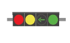

# 우회전 신호기

**가로식 4구** 신호기를 만들어보았다.  

>신호등이란?  
>차량이나 사람에게 진행 가능 여부 또는 진행 방향 등의 교통 신호를 알려주는 장치인 신호기

### 신호기 색에 따라 아래와 같이 진행

 1. 적색 : 정지
 2. 녹색 : 통과
 3. 황색 : 서행 및 경고
 4. 우회전 : 우회전 통과

---
## 업데이트

신호등의 **기계적인 타이밍** 구현 예정

 `적색` | `황색` | `녹색` | `우회전` | `비고`
 --- | --- | --- | --- | --- 
 ON | OFF | OFF | OFF | 완료(240306)
 OFF  | blink | OFF | OFF | 
 OFF  | OFF | ON | OFF | 완료(240306)
 OFF  | OFF | OFF | ON | 완료(240306)

 1. 적색등 : 녹색등 On/off 시 반대로 off/on 기능
2. 녹색등 : 우회전등 On/off 시 반대로 off/on 기능
3. 황색등 : 황색점멸등
4. 우회전등 : 녹색등 On/off 시 반대로 off/on 기능

### 업데이트 현황
이후 황색등의 점멸 기능 추가 예정

